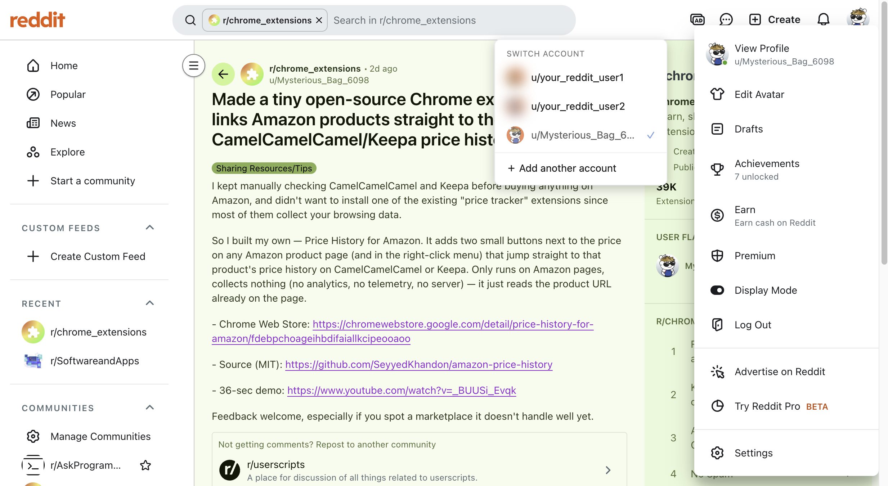
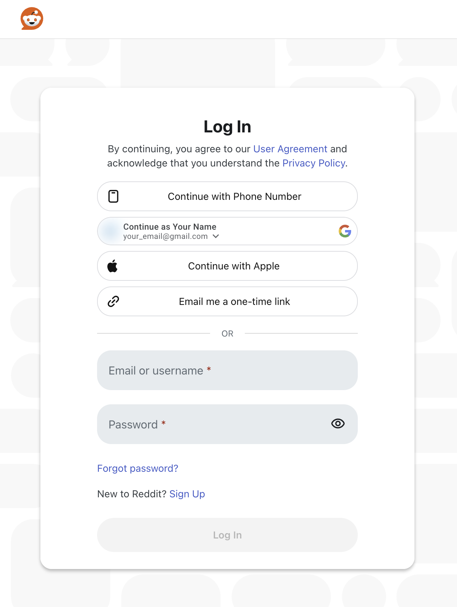

# Account Switcher for Reddit

Reddit's mobile app lets you switch accounts in one tap. The website doesn't. **This Chrome extension adds the same experience to the web**: click your profile icon, pick another account, done.

▶️ [Watch the 45-second demo on YouTube](https://www.youtube.com/watch?v=DZk6LELndAc)

## Why you'll like it
- **Simple, like on mobile** – a "Switch account" list right next to the profile menu, plus a toolbar popup.
- **No tracking** – no analytics, no telemetry, no server. Nothing leaves your browser.
- **No passwords saved** – you log in on Reddit's own page; the extension never sees or stores your password.
- **Open source** – MIT licensed, small enough to read in a few minutes.
- **Minimal permissions** – only `cookies` and `storage`, and only for `reddit.com`.

## Install (developer mode)
1. Open `chrome://extensions` and enable **Developer mode**.
2. **Load unpacked** → select this folder.

## Use
- Log in to Reddit normally – the account is saved automatically.
- Click your profile icon → **Switch account** → pick an account.
- **＋ Add another account** saves the current account and opens the login page. Log in with the other account and it is saved automatically.
- The toolbar icon opens the same list and lets you forget accounts.

## How it works
Reddit's web login is cookie based. Each saved account is a snapshot of the `reddit.com` cookies in `chrome.storage.local`. Switching clears the current cookies, restores the chosen snapshot and reloads Reddit tabs.

## Privacy and caveats
See [PRIVACY.md](PRIVACY.md).
- Saved sessions are equivalent to being logged in. They are stored unencrypted in local extension storage (never synced), so don't use this on a shared browser profile.
- Clicking Reddit's own **Log out** invalidates that account's session server-side; log in again to refresh it.
- The profile-button selectors in `content.js` (`PROFILE_BUTTON_SELECTORS`) depend on Reddit's markup and may need updating if Reddit changes it. The toolbar popup always works.

## Support
support.mhdi@gmail.com

## License
[MIT](LICENSE). Not affiliated with or endorsed by Reddit, Inc.
